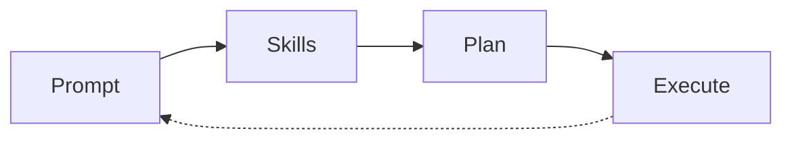

# Design and deploy browser agents for your LLMs
<!-- (<small>✨</small> magic as defined by [Arthur C. Clarke's 3rd Law](https://en.wikipedia.org/wiki/Clarke%27s_three_laws)) -->


| Connect LLMs to your browser...<br><small>(manage multiple connections)</small> | ...teach them some skills...<br><small>(<small>"when this happens, do that"</small>)</small>  | ...and help them learn!<br><small><b>(they get better over time!)</small> |
|-|-|-|
|  |  |  |

# Key features (so far)
- Shortcuts for everything; no mouse needed
- Quickly change models & configurations
- Multiple channels with system prompts


<br>
<br>
<br>
<br>

# How it works



## Skills

When you submit a Prompt it's checked against every Skill individually. A Skill is made up of two sub-prompts, a Trigger Prompt and a Response Prompt. ModelPrompter creates a 3 message stack and asks the LLM to return `1` if the Skill matches the user's prompt based on a Skill Checker Prompt, or `0` otherwise:

```js
[
  {
    role: 'system',
    content: SkillCheckerPrompt
  },
  {
    role: 'user',
    content: YourPrompt
  },
  {
    role: 'user',
    content: SkillTrigger1
  }
]
```

It does this for every Skill, creating a new stack of potential Skills to use. This new stack, along with the original Prompt, is then sent to the Planner.

### Planning
After the Skills are gathered, a new message stack is created by combining the Planning Prompt, the relevant Skills, and all of the Channel's messages and sent back to the LLM. This time, any output from the LLM rendered in a `<pre class="modelprompter"></pre>` will get extracted and run as JavaScript in the context of the browser extension.

```js
[
  {
    role: 'system',
    content: PlanningPrompt
  },
  ...Skills,
  ...ChannelMessages,
  {
    role: 'user',
    content: YourPrompt
  }
]
```

### Executing

Once the plan has been output and all of the code extracted and run, the Chat Turn has ended and the user must type another prompt to continue. However, ModelPromper exposes `modelprompter.prompt(newPrompt)` so that the LLM can act on behalf of the user and continue iterating on the plan.

<br>
<br>
<br>
<br>
<hr>
<br>
<br>
<br>
<br>

# Keyboard Shortcuts

After setup, press the icon or hold `CTRL+SHIFT` to begin navigating the interface. While holding that, tap left or right to change tabs and up and down to select things.


<br>
<br>
<br>
<br>
<hr>
<br>
<br>
<br>
<br>

# Install from source
> **Playstore coming soon:** I'll make it easier to setup later, but for now you'll need to build from source.

<br>

## Step 1 - Build the Browser Extension
### Requirements
- git - https://git-scm.com/downloads
- NodeJS - https://nodejs.org/en/download/

```bash
# Clone this project locally
git clone https://github.com/modelprompters/modelprompter
cd modelprompter

# Install dependencies
npm install
```

<br>

  ## Step 2 - Sideload the extension
1. Visit `chrome://extensions` (even if you're on edge etc, your browser should automatically redirect)
2. Enable **Developer Mode**
3. Click **Load unpacked extension** and select the `modelprompter/dist` folder
4. Enable the ModelPrompter extension
5. Click on the ModelPrompter icon or press <kbd>CTRL+SHIFT+SPACE</kbd> to begin

### Visual guide: Edge Browser


<br>
<br>
<br>
<br>
<hr>
<br>
<br>
<br>
<br>

# Developing
This project comes with a live reload server, so you can write code without having to manually refresh anything. Sometimes it crashes spectacularly though. If you suddenly start getting strange errors and bugs while you're developing, try manually reloading the extension.

```bash
# Start a local dev server
npm start

# Stop the server
# CTRL+C
```


## Markdown extensions
- [Markdown Attributes](https://github.com/arve0/markdown-it-attrs)
- [Mermaid](https://mermaid.js.org/intro/getting-started.html)
  - See here for extras: https://github.com/wekan/markdown-it-mermaid#readme

<br>
<br>
<br>
<br>
<hr>
<br>
<br>
<br>
<br>


# Research
- **Why are skills checked individually?** Although this creates more calls to the LLM, the idea is that it will make the system more accurate by hyperfocusing on one skill at a time.